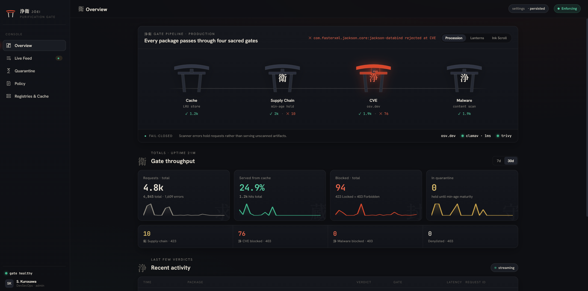

# Jōei: прокси, который не пускает вредоносные пакеты в вашу сборку

*[English version](overview.md)*

> 浄衛 — «Врата очищения». Прозрачный прокси для реестров пакетов и Docker-образов,
> который проверяет каждую загрузку до того, как она попадёт на машину разработчика
> или в CI.

## Проблема

Атаки на цепочку поставок стали обычной частью ландшафта угроз. Злоумышленник
захватывает аккаунт мейнтейнера или публикует пакет с похожим именем, и через
несколько минут вредоносная версия уже скачивается тысячами `pip install`,
`npm install` и `docker pull`. Типичные сценарии:

- **отравленный релиз**: новая версия популярной библиотеки с бэкдором, которую
  удаляют из реестра через несколько часов, но многие успевают её скачать;
- **известные уязвимости**: старая версия зависимости с опубликованной CVE
  продолжает подтягиваться по lock-файлу;
- **вредоносный код в артефакте**: архив пакета или слой образа содержит
  известную сигнатуру;
- **секреты в образах**: в слое Docker-образа остались ключи или токены.

Каждый из этих рисков можно закрыть отдельным инструментом в CI. Jōei закрывает
их на одном уровне, в точке загрузки, и разработчику для этого не нужно ничего
менять в своём рабочем процессе.

## Идея

Jōei — один бинарник на Go. Он встаёт между пакетным менеджером и upstream-реестром.
Клиент обращается к прокси вместо PyPI, npm, Maven Central, RubyGems, Go module
proxy или Docker Hub. Каждый запрос на скачивание артефакта проходит через
конвейер проверок («гейтов»). Если артефакт прошёл все проверки, он попадает в
локальный кэш и отдаётся клиенту. Если нет, клиент получает структурированный
JSON-ответ с причиной блокировки.

```
Разработчик (pip / npm / mvn / go / bundle / docker pull)
        │
        ▼
  ┌──────────────────────────────────────────────┐
  │                 Jōei :8080                   │
  │  1. Кэш (попадание отдаётся сразу)           │
  │  2. Supply-chain фильтр (мин. возраст)       │
  │  3. CVE-сканер (osv.dev; Trivy для образов)  │
  │  4. Антивирус (ClamAV / ICAP)                │
  └──────────────────────────────────────────────┘
        │
        ▼
   Upstream-реестр
```

Запросы к индексам и метаданным (например `/simple/requests/` для pip) проходят
насквозь без сканирования. Проверяется только то, что реально устанавливается.

## Четыре уровня защиты

Пакеты и Docker-образы проходят одни и те же гейты. Отличается только движок,
который стоит за отдельной проверкой.

### 1. Минимальный возраст пакета (衛, «стража»)

Прокси получает из реестра время публикации версии. Если версии меньше
`supply_chain.min_age_hours` (по умолчанию 24 часа), клиент получает
**HTTP 423 Locked** с полем `block_until`. Для Docker-образов датой публикации
служит поле `created` из конфигурации образа. Как и порог серьёзности CVE,
минимальный возраст настраивается: в `config.yaml` (или через
`JOEI_SUPPLY_CHAIN_MIN_AGE_HOURS`) и на лету в редакторе политики консоли.

Правило простое, но эффективное: большинство отравленных релизов находят и
удаляют в первые часы после публикации. Даже задержка в сутки отсекает целый класс
атак без каких-либо сигнатур.

Начиная с v0.5.0 для npm работает **фильтрация метаданных**. npm выбирает
версию по диапазону (`^1.0.0`) ещё до запроса tarball, поэтому раньше
заблокированная свежая версия ломала всю установку. Теперь прокси вырезает
неподходящие версии прямо из metadata-документа, и диапазон разрешается в самую
новую версию, разрешённую политикой. Установка проходит. Для правильной работы
HTTP-кэширования переписанные документы получают собственный `ETag`.

### 2. Известные уязвимости (浄, «очищение»)

Для пакетов движком CVE-гейта служит [osv.dev](https://osv.dev): по имени и
версии запрашиваются известные уязвимости. Для Docker-образов ту же роль играет
**Trivy**: он сканирует образ на уязвимости и дополнительно ищет в слоях
забытые секреты (ключи, токены). Это не отдельный шаг, а тот же гейт с той же
политикой: общий порог серьёзности и общий denylist.

Если найдена уязвимость с уровнем не ниже `cve.block_on` (по умолчанию `HIGH`),
ответ будет **403** со списком находок. Результаты osv.dev кэшируются в памяти.
Для принятых рисков есть allowlist с точностью до версии.

### 3. Антивирусная проверка

Артефакт скачивается во временный файл и проверяется **всеми** настроенными
движками: ClamAV по нативному протоколу `INSTREAM` и любым ICAP-сервером
(Kaspersky, Dr.Web и т.п.). Хватает одного срабатывания. У Docker-образа
проверяются config-блоб и каждый слой. Антивирусный вердикт
нельзя обойти через allowlist: скан выполняется при каждой загрузке.

### 4. Denylist

Пакеты из **denylist** блокируются всегда, вне зависимости от результатов
сканирования.

### Особенность Docker

Для Docker Jōei работает как pull-through registry mirror. Все гейты для образа
выполняются сразу, **на запросе манифеста**, поэтому отклонённый образ клиент
не получит даже частично.

## Принцип fail-closed

Главный инвариант проекта: **непроверенный артефакт не отдаётся никогда**.

- Сканер недоступен — запрос блокируется (503), а не пропускается.
- Запись в кэше с проваленной проверкой отдаёт 403.
- Консоль без настроенных пользователей отвечает 503 на `/api/` и никого не
  пускает, при этом прокси продолжает работать.

## Кэш, который сам себя перепроверяет

Одобренные артефакты хранятся локально: индекс в SQLite, файлы на диске,
LRU-вытеснение по лимиту `max_size_gb`. Повторные запросы обслуживаются без
обращения к upstream и помечаются заголовком `X-Joei-Cache: HIT`.

База CVE и антивирусные сигнатуры обновляются, поэтому вчера «чистый» пакет
сегодня может оказаться уязвимым. В Jōei перепроверка **ленивая**: у каждого
гейта свой TTL (по умолчанию 24 часа). Когда кэшированная запись запрашивается
после истечения TTL, просроченный гейт выполняется заново. Если запись больше не
проходит проверку, она удаляется. Нагрузка от перепроверок растёт с трафиком, а
не с размером кэша. Параллельные перепроверки одной записи объединяются в
единственный скан (singleflight).

Docker-образы, запрошенные по digest и имеющие свежий вердикт, отдаются из кэша
**офлайн**, без обращения к upstream.

## Поддерживаемые экосистемы

| Экосистема | Как подключить |
|---|---|
| PyPI | `--index-url http://<jo-ei>/pypi/simple/` |
| npm / Yarn | `--registry http://<jo-ei>/npm/` (Yarn через `/yarn/`) |
| Maven / Gradle | mirror на `http://<jo-ei>/maven/` |
| RubyGems / Bundler | `bundle config mirror.https://rubygems.org http://<jo-ei>/rubygems` |
| Go modules | `GOPROXY=http://<jo-ei>/go` |
| Docker Hub | `"registry-mirrors": ["http://<jo-ei>"]` в `daemon.json` |

Для каждого реестра можно указать упорядоченный список `upstreams` с
последовательным переключением (как в Nexus): 404, 5xx, таймаут или отказ
соединения переводят запрос на следующее зеркало. Корпоративные зеркала с
самоподписанными сертификатами подключаются через `tls.ca_files`, при этом
проверка TLS для публичных реестров не ослабляется.

Готовые конфигурации клиентов лежат в [`examples/`](../examples/).

## Консоль администратора

В бинарник встроен React SPA, доступный по адресу `/console/`. Он работает без
CDN и без npm-тулчейна при сборке: React вендорен, бандл собирается через
`go generate`. В консоли есть:

- **Overview**: конвейер гейтов, KPI (запросы, cache hit rate, блокировки по
  типам), спарклайны за 30 дней, здоровье сканеров;
- **живая лента запросов** через Server-Sent Events с вердиктами
  PASS / CACHE / BLOCK;
- **карантин**: какие пакеты удерживаются правилом минимального возраста прямо
  сейчас;
- **редактор политики**: режимы гейтов (`enforce` / `dry_run` / `off`), порог
  серьёзности CVE, allowlist для каждого гейта, denylist;
- **реестры и кэш**: upstream-зеркала, заполненность кэша, очистка устаревших
  записей.



Изменения политики применяются **сразу, без перезапуска**, и сохраняются в
базу. После первого запуска значения из `config.yaml` только инициализируют
пустое хранилище, а дальше источником истины служит БД.

Здоровье сканеров отслеживается активно (clamd `PING`, ICAP `OPTIONS`, Trivy
`/healthz`) и пассивно для osv.dev: статус выводится из реального трафика без
дополнительной нагрузки на публичный API.

### Аутентификация

Вход в консоль выполняется через JWT-сессии. Браузер хранит два HttpOnly-cookie
с `SameSite=Strict`: access на 15 минут и refresh на 7 дней. Скрипты и CI
получают bearer-токен через `POST /api/auth/login`. Пароли хранятся как
bcrypt-хеши (встроенная команда `jo-ei hashpw`), пользователей можно задать
через переменную окружения `JOEI_CONSOLE_AUTH_USERS`, чтобы хеши не попадали в
репозиторий. TLS в бинарник намеренно не встроен, его терминирует reverse proxy
перед Jōei.

## Архитектура

Проект построен вокруг одного правила зависимостей: **все пакеты зависят от
`internal/gate`, а `gate` зависит только от стандартной библиотеки**.

```
                 cmd/jo-ei  (composition root)
                     │
   ┌─────────┬───────────────┬──────────────┐
   ▼         ▼               ▼              ▼
 proxy    console       dockerproxy    … подсистемы
   └─────────┴───┬──────────┘
                 ▼
          internal/gate  (доменные типы + порты)
                 ▲
   ┌─────────┬───┴─────┬───────────┬──────────┐
 scanner  supplychain  policy   adapters   cache / telemetry
```

В `gate` описаны словарь предметной области (`PackageRef`, `ScanResult`,
`PolicyDecision`, вердикты) и порты (`RegistryAdapter`, `CVEScanner`,
`AVScanner`, `ArtifactCache`, `Recorder` и др.). Реализации удовлетворяют этим
интерфейсам структурно, а связываются только в `cmd/jo-ei`. Интерфейсы
объявлены рядом с потребителем, поэтому граф зависимостей ацикличен, а каждую
подсистему можно тестировать в изоляции.

Ключевые технические решения:

- **Один файл SQLite** (pure Go, без cgo) для телеметрии, настроек и индекса
  кэша. У каждого компонента свои миграции. Каждое событие пишется синхронной
  транзакцией, так что окна потери данных при падении нет.
- **Дисциплина исходящих запросов** (`internal/httpx`): для каждого
  upstream-хоста есть семафор параллелизма, token-bucket rate limiter и circuit
  breaker на 429/503. Все запросы идут через общий `http.Client` и расходуют
  один бюджет.
- **Ограничение параллельных антивирусных сканов** (`max_concurrent_scans`,
  по умолчанию 8): всплеск загрузок не перегружает пул воркеров clamd.
- **Ровно одно событие телеметрии на перехваченный запрос.** Сбой телеметрии не
  может сломать основной путь обработки запроса.

Начать чтение кода удобно с трёх файлов: `internal/gate/gate.go` (словарь),
`internal/proxy/handler.go` (конвейер, около 500 строк) и `cmd/jo-ei/main.go`
(сборка зависимостей).

## Быстрый старт

```bash
git clone https://github.com/ggwpLab/Jo-ei.git && cd Jo-ei
cp .env.example .env

HASH=$(printf '%s' 'change-me' | docker-compose run --rm -T jo-ei hashpw)
echo "JOEI_CONSOLE_AUTH_USERS=admin:$HASH" > .env
docker-compose up -d

pip install requests --index-url http://localhost:8080/pypi/simple/ --trusted-host localhost
```

ClamAV поднимается сайдкаром в compose-файле. Готовые бинарники для Linux,
macOS и Windows (amd64/arm64) публикуются на странице релизов, образ доступен
как `ghcr.io/ggwplab/jo-ei`.

## История развития

| Версия | Дата | Главное |
|---|---|---|
| 0.1.0 | 2026-07-04 | Первый публичный релиз: PyPI, npm, Maven, RubyGems, Docker; четыре гейта; консоль; персистентная телеметрия |
| 0.2.0 | 2026-07-19 | Ленивая перепроверка кэша по TTL вместо фонового обхода; очистка кэша по запросу |
| 0.3.0 | 2026-07-20 | Go modules; офлайн-выдача Docker-образов по digest; singleflight для перепроверок |
| 0.4.0 | 2026-09-06 | JWT-аутентификация вместо HTTP Basic; доверенные CA для upstream; снижение нагрузки консоли на CPU |
| 0.5.0 | 2026-09-28 | Фильтрация npm-метаданных: заблокированные версии скрываются, установка проходит |

Проект прошёл путь от первого коммита (30 мая 2026) до пяти релизов примерно за
четыре месяца. Go-кода вместе с тестами около 24 тысяч строк. Каждая функция
сопровождается дизайн-документом и планом реализации в `docs/superpowers/`.

## Кому подойдёт

- Командам, которым нужна защита от атак на цепочку поставок без перестройки CI.
- Компаниям с корпоративным антивирусом по ICAP, который хочется применить к
  open-source зависимостям.
- Изолированным и полуизолированным окружениям, где кэширующий прокси нужен в
  любом случае и логично сделать его заодно фильтрующим.

Важно помнить об ограничениях. Jōei не заменяет SCA-анализ исходников и не
ловит неизвестный вредоносный код, которого нет в сигнатурах. Правило
минимального возраста задерживает и легитимные срочные исправления, для них
предусмотрен allowlist.

## Ссылки

- Репозиторий: <https://github.com/ggwpLab/Jo-ei>
- Полный справочник конфигурации: [`docs/configuration.md`](configuration.md)
- Архитектура: [`docs/architecture.md`](architecture.md)
- Лицензия: MIT
